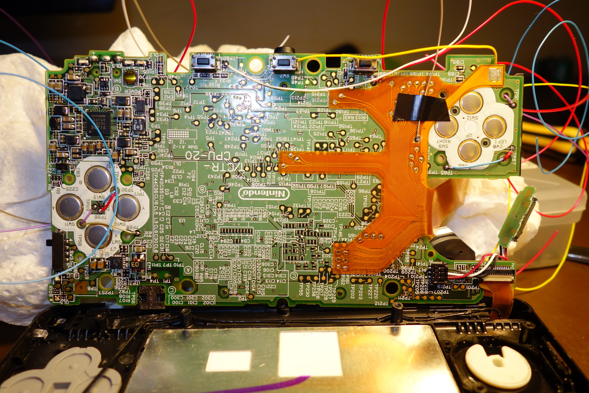
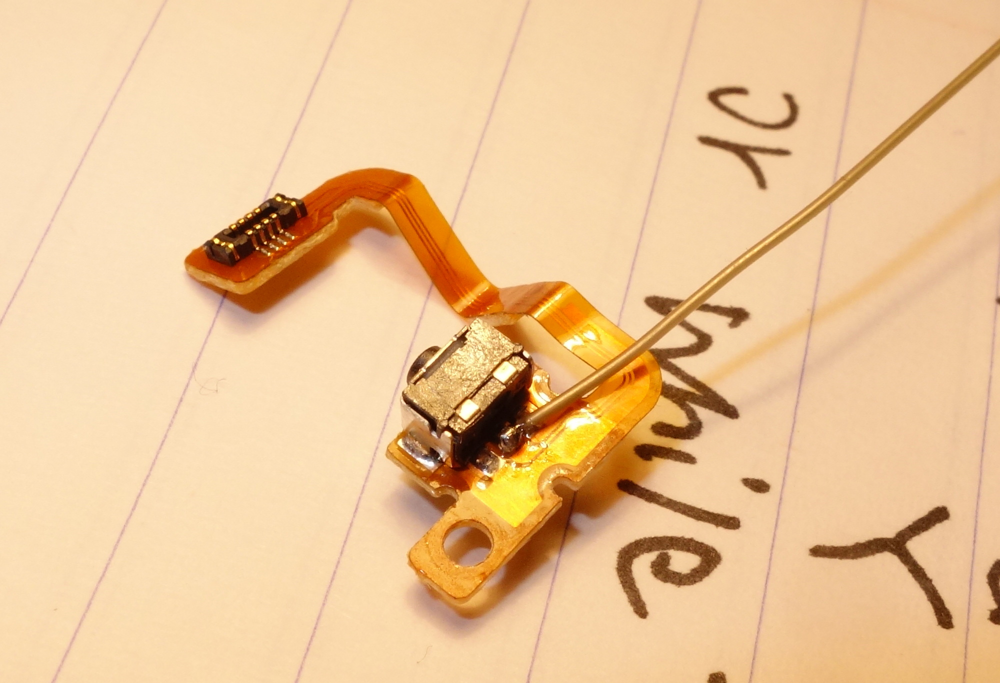
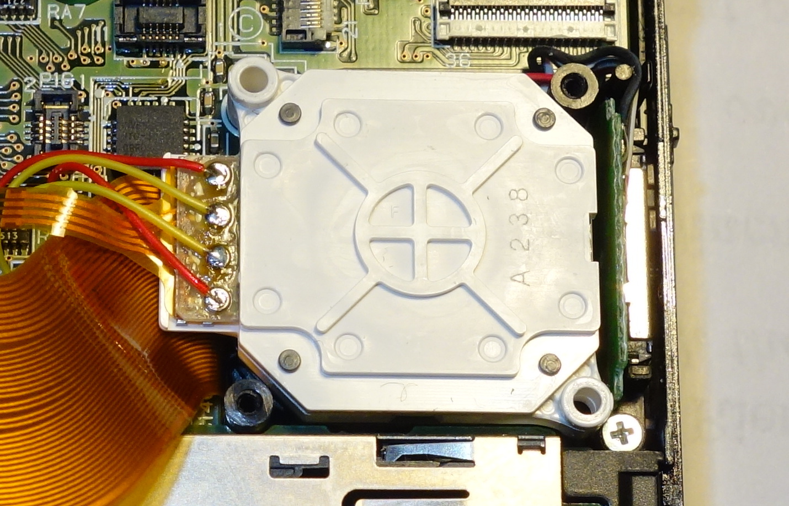
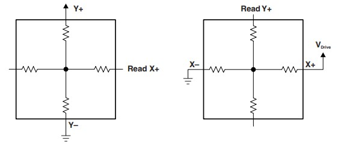
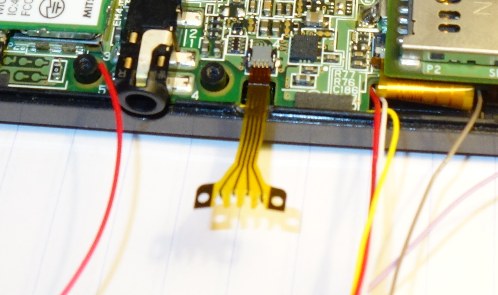
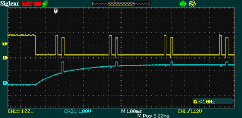

# 3DS Streaming Console with External Control Interface 技術概要

## 1. はじめに

3DS Streaming Console with External Control Interface（略して3xtDS）は、ニンテンドー3DS本体にキャプチャカードとUSBインターフェースを搭載し、外部からボタンやサークルパッド、タッチパネルを操作したり、画面や音声の内容を高画質でホスト側にストリーミングして録画や放送を行うことができるように改造した製品です。これにより、Twitchや他のウェブサイトでのインタラクティブなストリーミング、ゲームプレイの自動化、インターネットを介したリモートプレイ、代替コントローラの使用など、非常に興味深いアプリケーションを実現します。

このプロジェクトの構造は、比較的単純です。キャプチャーカードを搭載した3DSを分解し、ボタン、サークルパッド、タッチスクリーンの各種接点を取り出し、USBシリアル通信からコマンドを実行するマイコンで制御します。

このドキュメントは、このプロジェクトのいくつかの側面を簡単に説明したものであり、ゼロから作るためのステップバイステップのガイドではないことに注意してください。アナログ/デジタル回路、マイコンプログラミング、分解と組み立ての経験がある方以外は、自作に挑戦することはお勧めしません。高価なゲーム機を壊してしまう可能性が高いからです。

## 2. ハードウェアの概要

このプロジェクトのハードウェア面は、3DSを分解して、いくつかのテストポイントにワイヤーをはんだ付けするだけで、比較的簡単です。しかし、まず最初に、キャプチャカードを搭載した3DSを入手しなければなりません。このプロジェクトは、Redditユーザーのvelocikoopaさんが貸してくれたもので、彼のおかげで実現することができました。velocikoopaさんは、キャプチャーカード付きの3DSを600ドル近く払って購入したそうです。[もっと安いキャプチャーカード付き2DSは380ドルで発売されるそうです](https://web.archive.org/web/20140503042124/http://www.3dsvideocapture.com/product/40)。まだ実物を見ていないけれど。

始める前に、注意することがあります： 3DSのアースを取り出して、自分の回路に接続することを忘れないでください。また、3DSは1.8Vロジックを採用しているので、VCCといえば1.8Vのことです。

マザーボードを取り出すまでは、[iFixitの分解手順](https://web.archive.org/web/20140424135728/https://www.ifixit.com/Teardown/Nintendo%2B3DS%2BTeardown/5029)に従い、小さな部品や壊れやすいZIFフラットケーブルがたくさんあるので、注意してください。マザーボードの前面にあるボタンのテストポイントを探します。すなわち、TP85（上）、TP87（左）、TP91（下）、TP90（右）（これはキャプチャカード用のフラットケーブルの下にあるかもしれません、このテストポイントにアクセスするには少し切り込みます）、TP81（選択）と TP80（開始）です。A、B、X、Yのテストポイントのうち3つは、これら4つのボタンの真ん中にあり、もう1つはYボタンのすぐ上にあります。ホームボタンのテストポイントはありませんが、ボタンの左側のピンにワイヤーをハンダ付けすることができます。これが、すべてのワイヤーをはんだ付けした写真です：

LとRのショルダーボタンのテストポイントもありません。各ボタン自体の真ん中のピンに直接ワイヤーをハンダ付けしました：

さて、サークルパッドです。これは基本的に、各軸に1つずつ、2つの出力があるポテンショメーターです。この写真を見てください：

ピン配置は上から順に GND、x電位、VCC、y電位です。マイコンでサークルパッドを制御する場合は、電位出力線を外してマイコンからのDAC出力で代用します。範囲は0VからVCCまでです。

これまでのところ、ボタンとサークルパッドという、ごくごく簡単なものばかりでした。しかし、今、最大の難関に直面しています：誰かがタッチスクリーンを使っていると3DSを騙すことです。3DSは標準的な4線式インターフェースを使用しています。抵抗膜式タッチスクリーンがどのように機能するかについての一般的なアイデアを得るには、このドキュメントを参照することをお勧めします：

[http://www.ti.com/lit/an/slaa384a/slaa384a.pdf](https://web.archive.org/web/20140630073208/http://www.ti.com/lit/an/slaa384a/slaa384a.pdf)

ドキュメントの1.3節で説明されている方法と同様に、

3DSでは、Y+をVCCに、Y-をグランドに駆動し、X+での出力を測定することでX座標を得ることができます。同様に、X+をVCCに、X-をグランドに駆動すると、Y+でY座標が得られます。X座標とY座標を完全に読み取るには、X+、X-、Y+、Y-を200Hz程度で高速に入力と出力を切り替えています。

ソケットを破壊することなく、マザーボード上のタッチスクリーン入力とインターフェースできるように、4ピンのフラットケーブルを追加で入手することをお勧めします：

3DSのタッチスクリーンをシミュレートするためには、右側の最後の2つのピンだけが必要です。

ドキュメントの1.2節でに記載されているように、タッチパネルの読み取りは割り込み方式となっています。Y+端子は通常VCCにあり、タッチが発生するとグランドにプルされ、タッチ割り込みが発生し、サンプリング処理が開始されます。

X座標の書き込みは、マイコンのDAC出力とX+ピンを10Kの抵抗で直列に結び、X+が入力モードの時はDAC電圧を読み、X+が出力モードの時は抵抗で電流が流れないようにします。座標0〜320に対して0V〜1.8Vを書き込みます。

Y座標の場合、Y+ピンは割り込みも発生させるので、タイミングが必要です。1K抵抗でDACに接続した後、グランドに引き込んでタッチ割り込みを発生させ、このピンをオンボードADCでモニタします。Y+ピンが出力（X座標の読み取り）に切り替わったら、500μ秒待ち、Y+は入力モードになります。DACを使ってY座標をY+に書き込み、200μ秒保持し、再びグランドに引き下げます。座標0から240まで0Vから1.8Vを書き込みます。

タイミングはこのようになります：

黄色がY+、青がX+です。

これで3DSの制御線はすべて揃いました。あとはマイコンにつないで制御してもらうだけです！制御ボードのeagleファイルを見てください。

## 3. 制御ボード

3DSから出た配線はすべて制御ボードに入り、マイクロコントローラー（この場合はTeensy 3.1）に到達します。Arduinoを使うこともできますが、十分なピンがあることを確認してください。また、ArduinoのUSBシリアルは、Teensy 3.1の12Mbit/sフルスピードUSBシリアルほど高速ではないことに注意してください。

ボードのサイズは、私が使っているフライス盤の限界のためにかなり大きくしたので、遠慮なく縮小してください。

コントロールボードの回路も非常にシンプルです。ボタンはすべてアクティブローなので、押したいときはグランドに引きます。1つ問題があるとすれば、ロジックレベルです。3DSは1.8Vを使い、teensyは3.3Vを使います。私は74540バッファをレベルシフターとして使用しました。チップに1.8Vを供給し、3.3Vの信号を送ると、もう一方の端から1.8Vの信号が出て、3DSに届きます。

Teensy 3.1には、A14に本物のDACがあり、PWMピンも多数用意されています。タッチスクリーンのY+を制御するために、非常に高速な応答が必要なので、本物のDACを使用しました。PWM出力は、立ち上がり時間と出力に残る高周波成分とのトレードオフになりますが、フィルタリングしてDACを作ることも可能です。私は、サークルパッドX、サークルパッドY、タッチスクリーンX（上の写真の青いチャンネルの立ち上がり時間が遅いのはそのため）、およびロジックスイッチングチップの電源として4つのPWM DACを使用しました。

また、SPIやハードウェアシリアルピンのヘッダも追加したので、これらの通信プロトコルを使用する必要がある場合は、ご利用ください。

## 4. コマンド

| コマンド                       | 例         | 概要                                                                                                                                                                                                                                                                               |
| ------------------------------ | ---------- | ---------------------------------------------------------------------------------------------------------------------------------------------------------------------------------------------------------------------------------------------------------------------------------- |
| cn x y                         | cn 127 200 | <i><u>C</u>ircle pad <u>n</u>udge</i>  サークルパッドを`(x,y)`に押し出し、`c_pad_nudge_delay_ms`ミリ秒間保持し、その後離します。 `x`および`y`はそれぞれ255以下、0以上にしてください。 127がニュートラルポジションで、127より大きいと左/上、小さいと右/下になります。 |
| ch x y                         | ch 20 127  | <i><u>C</u>ircle pad <u>h</u>old</i>  サークルパッドを`(x,y)`で保持します。 `x`および`y`の範囲は`cn`と同様です。                                                                                                                                                                  |
| cr                             | cr         | <i><u>C</u>ircle pad <u>h</u>old</i>  サークルパッドをデフォルト位置に戻します。                                                                                                                                                                                             |
| cd c_pad_nudge_delay_ms        | cd 200     | <i><u>C</u>ircle pad set nudge <u>d</u>elay</i>  `cn`が呼び出されたときに、サークルパッドを押し出してから離すまでの時間を設定します。                                                                                                                                            |
| tc x y                         | tc 133 70  | <i><u>T</u>ouch screen <u>c</u>lick</i>  タッチパネルの`(x,y)`を押し、`touch_screen_click_delay_ms`ミリ秒間保持し、その後離します。 `x`は320以下、`y`は240以下にします。                                                                                                          |
| td touch_screen_click_delay_ms | td 200     | <i><u>T</u>ouch screen set click <u>d</u>elay</i>  `tc`が呼び出されたときに、タッチパネルを保持してから離すまでの時間を設定します。                                                                                                                                            |
| bc \[button\]                  | bc a       | <i><u>B</u>utton <u>c</u>lick</i>  ボタンを押し、`button_click_delay_ms`ミリ秒間保持し、その後離します。 ボタンの引数については、次の表を参照してください。                                                                                                                 |
| bh \[button\]                  | bh a       | <i><u>B</u>utton <u>h</u>old</i>  ボタンを押します。                                                                                                                                                                                                                         |
| br \[button\]                  | br a       | <i><u>B</u>utton <u>r</u>elease</i>  ボタンを離します。                                                                                                                                                                                                                      |
| br                             | br         | <i><u>B</u>utton <u>r</u>elease all</i>  すべてのボタンを離します。このコマンドには引数はありません。                                                                                                                                                                        |
| bd button_click_delay_ms       | bd 100     | <i><u>B</u>utton set click <u>d</u>elay</i>  `bc`が呼び出されたときに、ボタンを保持してから離すまでの時間を設定します。                                                                                                                                                        |

| 3DSのボタン | `bc`, `bh`, `br`の引数 |
| ----------- | ---------------------- |
| A           | a                      |
| B           | b                      |
| X           | x                      |
| Y           | y                      |
| ↑           | u                      |
| ↓           | d                      |
| ←           | l                      |
| →           | r                      |
| L           | ls                     |
| R           | rs                     |
| Start       | st                     |
| Select      | sl                     |
| Home        | h                      |